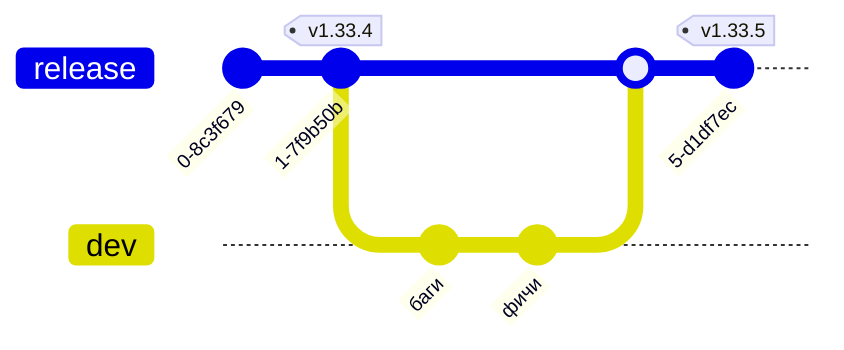
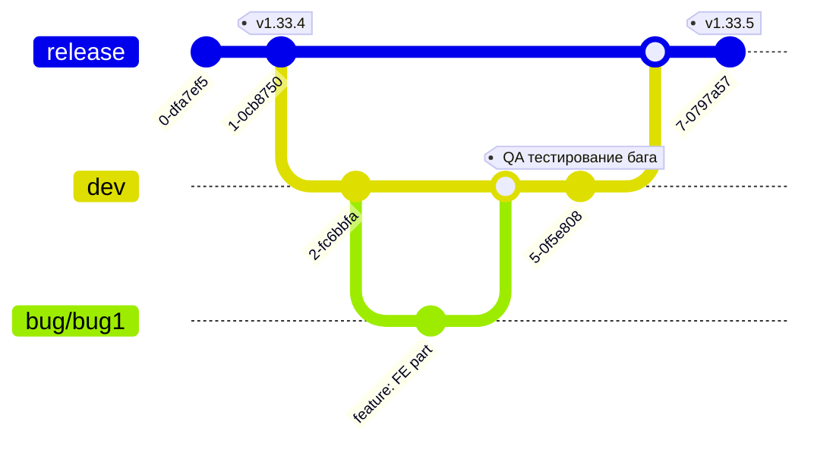

# Git Flow: release/dev/feature/bug/hotfix + QA

Этот документ описывает предлагаемый git flow, зачем он нужен и как в нем
появляются точки QA. Диаграммы сделаны отдельно для каждого сценария.

## Зачем такая схема

- `release` хранит текущий стабильный релиз и покрывается тегами.
- `dev` — основная ветка разработки следующего минорного релиза.
- Из `dev` ведутся фичи и баги, чтобы изолировать работу и упростить ревью.
- `hotfix` позволяет быстро исправлять критичные проблемы в уже выкачанном
  релизе.

## Базовые ветки и теги

## Фича: работа в ветке + QA до слияния

QA для фичи проводится в самой фиче перед ее слиянием в `dev`.

## Баг: ветка от dev + QA после слияния

QA для бага проводится после слияния в `dev`.

## Hotfix: быстрый ремонт релиза (TODO для QA)

Hotfix делается, когда текущий минорный релиз критично сломан.

**TODO: Определить, где и как проходит QA hotfix**

## Минорный релиз: freeze dev и merge в release

Перед слиянием `dev` в `release` нужен фриз `dev` и полное тестирование
фич и багов, вошедших в минорную версию.

